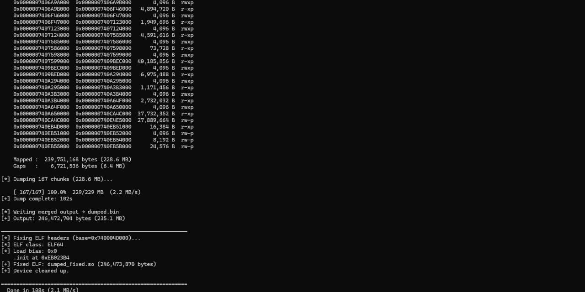
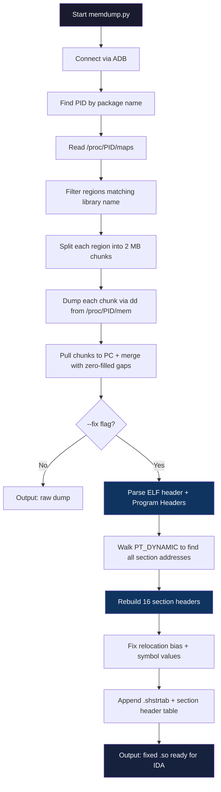
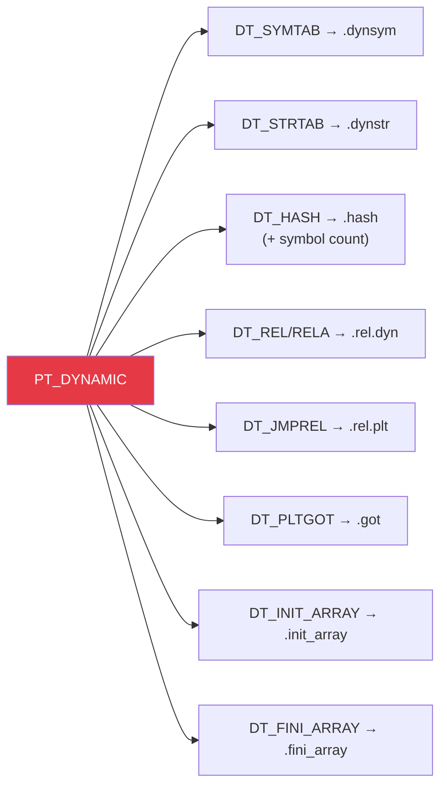
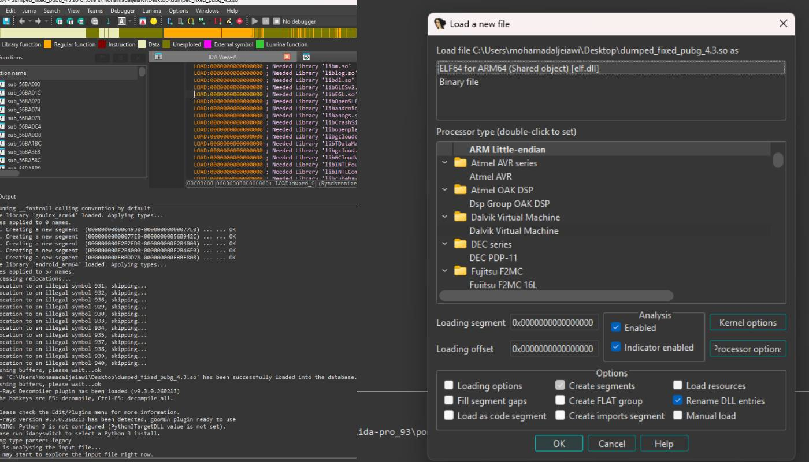

<p align="center">
  
</p>

<p align="center">
  <strong>Dump &amp; reconstruct Android native libraries (.so) straight from process memory — single Python script, zero compilation.</strong>
</p>

<p align="center">
  <a href="#quick-start">Quick Start</a> •
  <a href="#how-it-works">How It Works</a> •
  <a href="#usage">Usage</a> •
  <a href="#elf-fixer">ELF Fixer</a> •
  <a href="#requirements">Requirements</a> •
  <a href="#credits">Credits</a>
</p>

---

## What is this?

A single-file Python tool that:

1. **Dumps** a loaded `.so` library from a running Android process memory via ADB
2. **Fixes** the dumped ELF by rebuilding all 16 section headers from scratch

The fixed output loads cleanly in IDA Pro, Ghidra, or any ELF analysis tool — with full symbol resolution, `.plt`/`.got` recovery, and proper section mapping.

**Built for:** security researchers, reverse engineers, and developers debugging packed/protected native libraries (UPX, Bangcle, 360 Jiagu, Tencent, etc.)

---

## Features

| Feature | Description |
|---|---|
| **Region-aware dump** | Reads each mapped region individually — never touches unmapped gaps |
| **Chunked transfer** | Splits large regions into 2 MB chunks with real-time progress |
| **ELF section rebuilder** | Reconstructs 16 section headers from `PT_DYNAMIC` alone |
| **ELF32 + ELF64** | Full support for ARM (armeabi-v7a) and AArch64 (arm64-v8a) |
| **Single file** | One `memdump.py` — no compilation, no dependencies beyond Python 3.7+ |
| **Fix-only mode** | Fix any existing memory dump without ADB |
| **Anti-anti-dump** | Optional `SIGSTOP` to freeze the process during extraction |

---

## Quick Start

```bash
# Clone
git clone https://github.com/mohamad-aljeiawi/android-memdump-elf.git
cd android-memdump-elf

# Dump + fix in one command
python memdump.py com.example.app libtarget.so --fix

# Output:
#   libtarget_dump.bin        ← raw memory dump
#   libtarget_dump_fixed.so   ← ready for IDA/Ghidra
```

---

## How It Works



### Dump Phase

The tool reads `/proc/PID/maps` to find all memory regions belonging to the target library. Instead of reading one giant contiguous range (which stalls on unmapped gaps), it dumps each mapped region individually in 2 MB chunks:

```
Region 0:  0x7400000000 - 0x7405700000  [87 MB]  r--p  → 44 chunks
Region 1:  0x7405700000 - 0x7405713000  [76 KB]  r-xp  → 1 chunk
Region 2:  0x7405713000 - 0x7405715000  [8 KB]   rwxp  → 1 chunk
...
```

Each chunk is a direct `adb shell su -c 'dd ...'` call with immediate pull and cleanup. Unmapped gaps between regions are filled with zero bytes to preserve correct offsets.

### Fix Phase

The fixer reconstructs ELF section headers entirely from information available in `PT_DYNAMIC`:



**Sections rebuilt (16 total):**

`NULL` · `.dynsym` · `.dynstr` · `.hash` · `.rel.dyn` · `.rel.plt` · `.plt` · `.text` · `.ARM.exidx` · `.fini_array` · `.init_array` · `.dynamic` · `.got` · `.data` · `.bss` · `.shstrtab`

**Additional fixes applied:**

- Subtract load bias from all `p_vaddr` / `p_offset` in program headers
- Set `p_offset = p_vaddr` and `p_filesz = p_memsz` (memory layout = file layout)
- Fix `R_ARM_RELATIVE` / `R_AARCH64_RELATIVE` relocation offsets
- Fix `R_ARM_JUMP_SLOT` / `R_AARCH64_JUMP_SLOT` entries
- Subtract bias from all `st_value` in `.dynsym`
- Correct invalid symbol types (for IDA compatibility)
- Subtract image base from `R_*_RELATIVE` pointed values

---

## Usage

### Dump + Fix (most common)

```bash
python memdump.py com.example.app libtarget.so --fix
```

Produces:
- `libtarget_dump.bin` — raw memory dump
- `libtarget_dump_fixed.so` — IDA-ready with section headers

### Custom output name

```bash
python memdump.py com.example.app libtarget.so -o my_dump.bin --fix
```

### Fix an existing dump (no ADB needed)

```bash
python memdump.py --fix-only dumped.bin 0x740004D000 fixed.so
```

### Freeze process during dump (anti-anti-dump)

```bash
python memdump.py com.example.app libtarget.so --fix --stop
```

Sends `SIGSTOP` before dumping, `SIGCONT` after. Useful when the app detects memory reading.

### Dump each region as a separate file

```bash
python memdump.py com.example.app libtarget.so --segments
```

### Larger chunk size (faster on good USB connections)

```bash
python memdump.py com.example.app libtarget.so --fix --chunk-mb 4
```

### All options

```
python memdump.py [-h] [--fix] [--stop] [--segments]
                  [--chunk-mb N] [-o OUTPUT]
                  [--fix-only DUMP BASE_HEX OUTPUT]
                  package library
```

| Flag | Description |
|---|---|
| `--fix` | Rebuild ELF section headers after dump |
| `--stop` | `SIGSTOP` the process during dump |
| `--segments` | Save each memory region as a separate file |
| `--chunk-mb N` | Chunk size in MB (default: 2.0) |
| `-o OUTPUT` | Custom output file path |
| `--fix-only` | Fix-only mode — no ADB, takes `<dump> <base_hex> <output>` |

---

## Example Output

```
============================================================
  memdump — ADB Memory Dumper + ELF Fixer
============================================================
  Package : com.tencent.ig
  Library : libUE4.so
  Output  : dumped.bin
  Fix ELF : yes
============================================================

[*] Checking ADB...
[+] Device connected.
[+] PID: 21110
[*] Reading /proc/21110/maps

[+] 61 regions for 'libUE4.so':
    Mapped :  239,751,168 bytes (228.6 MB)
    Gaps   :    6,721,536 bytes (6.4 MB)

[*] Dumping 167 chunks (228.6 MB)...
    [ 167/167] 100.0%  229/229 MB  (2.2 MB/s)
[+] Dump complete: 102s

[*] Fixing ELF headers (base=0x740004D000)...
[*] ELF class: ELF64
[+] Fixed ELF: dumped_fixed.so (246,473,870 bytes)

============================================================
  Done in 108s (2.1 MB/s)
============================================================
```

<p align="center">
  
</p>

---

## Requirements

| Requirement | Details |
|---|---|
| **Python** | 3.7 or higher |
| **ADB** | Installed and in PATH |
| **Android device** | Root access (`su` available) |
| **USB** | Debugging enabled, device authorized |

No external Python packages needed — uses only `struct`, `subprocess`, `re`, `os`, `sys`, `argparse`, `time`, `pathlib`.

### Device setup checklist

```bash
# Verify ADB connection
adb devices

# Verify root access
adb shell su -c "whoami"    # should print "root"

# Verify target app is running
adb shell pidof com.example.app
```

---

## How the ELF Fixer Works (Technical)

When a `.so` is loaded into memory by the Android linker, the **section header table is discarded** — it's not needed at runtime. Packers exploit this by stripping or corrupting section headers to prevent static analysis.

This tool rebuilds them using the one structure that **must survive** in memory: the **dynamic segment** (`PT_DYNAMIC`).

### The reconstruction algorithm

```
1. Parse ELF header → get program header table offset + count
2. Walk program headers:
   - Find first PT_LOAD → compute load bias
   - Find PT_DYNAMIC → get dynamic section location
   - Find PT_LOPROC → get .ARM.exidx location
3. Fix all program headers: subtract bias, set offset = vaddr
4. Walk dynamic entries (DT_SYMTAB, DT_STRTAB, DT_HASH, ...):
   - Each tag gives the address + size of a section
   - Subtract bias from all pointers
5. Compute derived sections:
   - .plt starts after .rel.plt (aligned)
   - .text starts after .plt, ends at .ARM.exidx
   - .got starts after .dynamic
   - .data starts after .got (page-aligned)
6. Fix relocations: subtract bias from R_*_RELATIVE offsets
7. Fix symbols: subtract bias from st_value
8. Write: original body + .shstrtab + 16 section headers
```

---

## Credits

The **ELF section header fixer** is a pure Python port of the C++ logic from [**elf-dump-fix**](https://github.com/maiyao1988/elf-dump-fix) by **maiyao1988**, later maintained by [**strazzere**](https://github.com/strazzere/elf-dump-fix). The original algorithm for reconstructing section headers from `PT_DYNAMIC` was designed by maiyao1988.

**Key differences from the original:**
- Pure Python — no compilation, runs on Windows/macOS/Linux
- Integrated dump + fix in a single tool
- Region-aware chunked dumping (handles 200+ MB libraries)
- Real-time progress tracking

---

## License

MIT License — see [LICENSE](LICENSE) for details.
